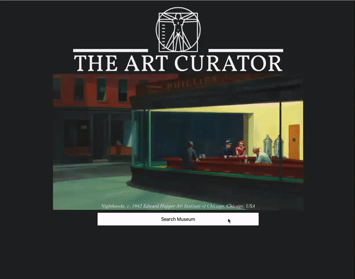
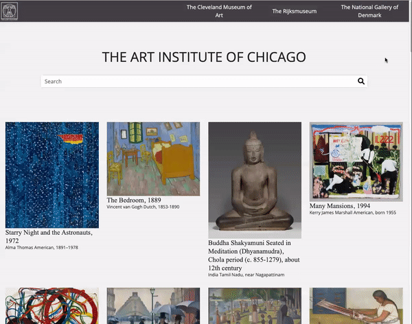

<h2>Summary</h2>

  - [About the Project](#about-the-project)
  - [Usage](#usage)
  - [Videos & Screenshots](#videos-and-screenshots)
  - [Built With](#built-with)
  - [Authors](#authors)
  - [Acknowledgments](#acknowledgments)

## About The Project
**The Art Curator** allows you to visit four different museums from the comfort of your own home. It takes away having to search through their website to locate their online collection as well. All of the artpieces on display are open access; meaning that they are no longer under a copyright and free for one to use *(so long as you're not using them for monetary gain)*. 

If you're simply wanting to expand your knowledge on art but don't know where to start, The Art Curator is a good place to start. It provides the basic information on art pieces and allows you to search by just about anything that could be related to a certain artpiece. 

Visit The Art Curator to see artworks that are possibly miles away from you, easy to search through, and without having to deal with the large crowds. 

## Usage 
The Art Curator uses four different API's from four different museums:

- [The Art Institute of Chicago](https://api.artic.edu/docs/)
- [The Cleveland Museum of Art](https://www.clevelandart.org/open-access)
- [The Rijksmuseum](https://data.rijksmuseum.nl/object-metadata/api/)
- [The National Gallery of Art](https://open.smk.dk/)

From these four museums, The Art Curator displays the following information:
- An image of the artwork *(via the preview and the modal)*
- The name of the artwork
- The year(s) in which it was created
- The name of the artist the artwork is attributed to

The Art Curator allows you to search by the name of the artwork or the name of an artist. If you don't know the name of the artwork or the name of the artist but know that the art piece you are looking for depicts, for example, flowers, you can enter the word flowers in the search bar and The Art Curator will pull all images in which the word *flowers* is a keyword *(whether the word is in the title, a part of the artist's name or a keyword related to the art piece)*. 

You are also able to click on the image and view the image at a higher resolution via a modal. It has been built to be responsive with specifications set for small mobile phones, regular mobile phones, tablets, desktops, and widescreens. 

## Videos & Screenshots

## Built With 
  - [Javascript](https://www.javascript.com/)
  - [HTML](https://www.w3schools.com/html/default.asp)
  - [CSS](https://www.w3schools.com/css/default.asp)
  - [Bootstrap](https://getbootstrap.com/)
  - [Adobe Express](https://express.adobe.com/sp)

## Authors 
 - **Joselyn Diaz** - [jdiaz483](https://github.com/jdiaz483)

## Acknowledgements
Thanks to the four museums and their relatively easy to understand API's:

- [The Art Institute of Chicago](https://www.artic.edu/) in *Chicago, IL, USA*
- [The Cleveland Museum of Art](https://www.clevelandart.org/) in *Cleveland, OH, USA*
- [The Rijksmuseum](https://www.rijksmuseum.nl/en) in *Amsterdam, NE, EU*
- [The National Gallery of Art](https://www.smk.dk/en/) in *Coppenhagen, DE, EU*

